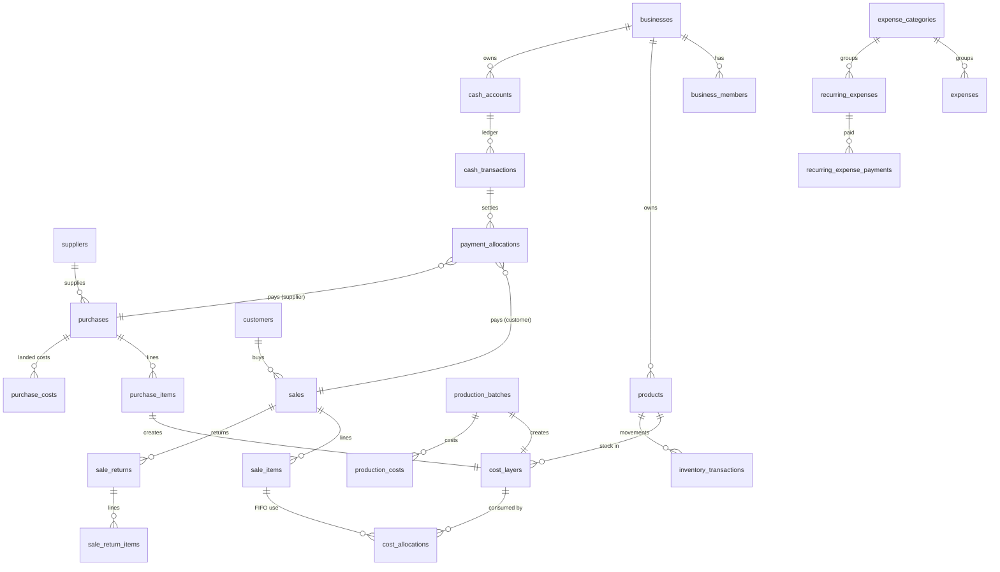

# PLAN.md: Financial Command Center

Status: **Phase 5 complete — all phases built.** Quality bar: see QUALITY.md (all yes).
Working name: **Ledgr** (placeholder; rename anytime)
Guiding rule: *Complexity belongs in the engine. Simplicity belongs in the interface.*

---

## 1. The short version

- **What:** a web app where a Nigerian trading business records sales, purchases, production, expenses and payments. From those records it shows profit, cash, who owes whom and stock value. Every number can be traced back to the records behind it.
- **How:** Next.js on Vercel, with a Supabase Postgres database. **The database is the single source of truth for money.** Anything that changes stock or money (a sale, purchase, return, void) runs as one atomic database function. A crash or double-tap therefore can never leave half a sale recorded.
- **Order:** engine and tests first, the dashboard second, reports third, controls fourth, polish last. I stop after every phase.

---

## 2. System architecture

```
 Phone / Desktop browser
        │  (Next.js pages, server components, server actions)
        ▼
 ┌─────────────────────── Vercel (Next.js App Router) ───────────────────────┐
 │  UI layer          app/(app)/…   React server + client components         │
 │  Action layer      server actions: validate with Zod → call DB function   │
 │  Finance engine    /lib/finance  pure TypeScript: periods, accruals,      │
 │                    margins, comparisons, break-even, estimates, formatting │
 │  Report layer      /lib/reports  P&L, cash flow… → screen / PDF / CSV / XLSX│
 └───────────────────────────────┬────────────────────────────────────────────┘
                                 │ supabase-js (user JWT) — RLS enforced
                                 ▼
 ┌──────────────────────────── Supabase ─────────────────────────────────────┐
 │  Auth (email + password)      Storage (receipts, private bucket)          │
 │  Postgres:                                                                  │
 │   • tables with RLS on every business-owned row                           │
 │   • POSTING functions (plpgsql, one transaction each):                    │
 │       post_sale, post_purchase, post_production, post_return,             │
 │       record_payment, void_document, transfer_cash …                      │
 │   • READ functions (fast SQL aggregates for any date range):              │
 │       fin_pnl, fin_cash_flow, fin_receivables, fin_inventory_value,       │
 │       fin_recurring_accrual, fin_expense_breakdown …                      │
 │   • audit trigger on every financial table                                │
 └────────────────────────────────────────────────────────────────────────────┘
```

**Who does what (important for trust):**

| Job | Where | Why |
|---|---|---|
| FIFO stock costing, posting sales/purchases/returns/voids | Postgres functions | Must be atomic and must lock stock rows so two sales can't use the same unit |
| Summing a period (revenue, COGS, expenses, cash) | Postgres read functions | Fast with thousands of rows; the browser never downloads raw transactions to add them up |
| Formulas on those sums (margins, % change, break-even, estimates, "New" / "—" rules) and period maths (weeks, month-to-date, Lagos timezone) | `/lib/finance` (TypeScript, runs on the server) | Pure functions that are easy to unit-test; the future AI assistant uses them as its only data layer |
| Live preview in the sale form | Browser (preview only) + `preview_sale` DB function for COGS | The preview never gets saved; the server recalculates when you save |

---

## 3. Technology stack

Next.js 15 (App Router) · TypeScript strict · Supabase (Postgres 15+, Auth, Storage, RLS) · Tailwind CSS v4 · shadcn/ui (restyled to our tokens) · Recharts · Zod · react-hook-form · date-fns + date-fns-tz · Vitest · Playwright · Vercel.
Also: `@react-pdf/renderer` (PDF reports and invoices), `exceljs` (XLSX), plain CSV.

---

## 4. Financial rules and how each one is implemented

| # | Rule | Implementation |
|---|---|---|
| R1 | Money is stored as integer kobo | Every money column is `bigint` (kobo) plus a `currency char(3)` default `'NGN'`. TS uses a branded `Kobo` type; there are no floats in any money path. Display formatting happens only in `formatMoney()`. |
| R2 | Exact splitting | **Cumulative-floor allocation**: part *i* of *n* = `floor(T·i/n) − floor(T·(i−1)/n)`, so the parts always add up exactly to T. This is used for daily accruals, invoice discounts, landed costs and unit costs. |
| R3 | Time | Business setting `timezone` (default `Africa/Lagos`), `week_start` (default Monday) and `fy_start_month`. Documents store a business-local `date` column plus `created_at timestamptz`. Period boundaries are computed in `/lib/finance/periods.ts`. |
| R4 | Revenue | Net revenue = gross − discounts − returns. It is recognised on the sale date regardless of payment. VAT is stored per sale (`vat_rate`, `prices_include_vat`, `vat_amount`) and is **never** part of revenue; it accumulates as VAT payable. |
| R5 | FIFO COGS | `cost_layers` (one per purchase line, production batch or return) hold `qty_in`, `qty_remaining` and `total_cost`. `post_sale` locks layers `FOR UPDATE` oldest-first, consumes them, and writes one `cost_allocations` row per layer used. The COGS for units *a..b* of a layer uses the cumulative-floor formula, so a fully used layer adds up exactly to its cost. Costing is a strategy column (`costing_method = 'fifo'`), leaving room for weighted average later. |
| R6 | Inventory is not an expense | A purchase creates a cost layer (asset) and either a cash-out or a payable. It never creates an expense row. |
| R7 | Recurring expenses accrue by day | No rows are pre-generated. `fin_recurring_accrual(from, to)` calculates on demand. Monthly, quarterly and annual items become a monthly amount, spread over that month's days with cumulative-floor. Weekly and daily items are spread per day. Partial first and last months are prorated from the start and end dates. |
| R8 | Paying is not a second expense | `recurring_expense_payments` create cash-outs only. Prepaid / (owed) = paid to date − accrued to date, shown on each recurring item. |
| R9 | Cash is separate | `cash_accounts` (cash, bank, POS, mobile money, other) each have an opening balance. `cash_transactions` is the **only** cash ledger, with a typed `kind` (see §5). Transfers are two linked rows with kind `transfer`, which are excluded from income and expense. |
| R10 | Non-P&L items | `capital_injection`, `loan_received`, `loan_repayment` (principal) and `owner_withdrawal` affect cash only. Loan interest is an expense in category kind `other_expense`. |
| R11 | Profit | Gross = net revenue − COGS. Operating = gross − operating expenses. Net = operating + other income − other expenses − income tax. A margin with zero revenue returns `null` and displays "—". |
| R12 | Returns | `post_return` reverses revenue at the original net line price, reverses COGS using the **original** allocations (pro rata), and creates a new cost layer at that cost (unless marked damaged). The refund becomes a cash-out or a customer credit. |
| R13 | No hard deletes | Financial tables have no DELETE grant. `void_document(id, reason)` sets `voided_at/by/reason`, writes reversing inventory transactions and restores layers. Voided rows are excluded from every read function. Inventory transactions are insert-only (a trigger blocks update and delete). |
| R14 | Missing data | Each sale line has `cost_status` ∈ `actual` \| `estimated` (fell back to product standard cost) \| `missing` (COGS is `NULL`). Read functions return counts per status. Completeness = `complete` / `partial` / `missing_data`. Profit is never computed as if missing cost were ₦0. "Fix missing costs" sets a `manual` cost with an audit entry. |
| R15 | Comparisons | `comparePeriods()` compares like with like: week-to-date vs the same weekdays last week, and month-to-date vs the same number of days last month (capped at month end). If the previous value is 0, it returns `{kind:'new'}`. If the sign flips, it returns `{kind:'turned_profit' \| 'turned_loss'}`, which the UI shows in words. |
| R16 | Month-end estimate | (MTD gross profit ÷ days elapsed × days in month) − the full month's accrued operating expenses. It returns the formula inputs, and the UI always labels it "Estimate". |
| R17 | Break-even | Monthly fixed operating costs ÷ gross-margin ratio over the trailing 30 days (configurable). It returns `null` with a reason if the margin is ≤ 0 or unknown. There is also a per-product calculator. |

---

## 5. Database schema

All IDs are `uuid`. Every business-owned table has `business_id`, `created_at`, `updated_at` and `created_by`. Money is `bigint` kobo. Check constraints enforce qty > 0, price ≥ 0 and amount ≥ 0.

**Tenancy and people**
- `businesses`: name, type, currency, timezone, week_start, fy_start_month, vat_registered, vat_rate_bp (basis points, e.g. 750), prices_include_vat, costing_method, default_payment_terms_days, settings jsonb
- `business_members`: business_id, user_id → auth.users, role (`owner|admin|accountant|sales|viewer`), can_see_costs bool
- `profiles`: user_id, full_name, display_name (used for "Good morning, Mo")

**Parties**
- `customers`: name, phone, email, address, payment_terms_days, notes (plus a built-in "Walk-in customer" row)
- `suppliers`: name, contact, phone, email, notes

**Catalogue and stock**
- `product_categories`
- `products`: name, sku (unique per business), category_id, default_supplier_id, unit, selling_price, standard_cost (nullable fallback), min_stock, is_active, notes
- `cost_layers`: product_id, source_type (`purchase|production|return|opening|adjustment`), source_id, layer_date, qty_in, qty_remaining, total_cost
- `inventory_transactions` (insert-only): product_id, date, kind (`opening|purchase|production|sale|return|adjustment|void_reversal`), qty_change (signed), cost_change (signed kobo), source_type, source_id
- `cost_allocations`: sale_item_id, cost_layer_id, qty, cost

**Buying and making**
- `purchases`: supplier_id, date, supplier_invoice_no, due_date, status, allocation_method (`value|quantity`), subtotal, direct_costs_total, total, voided_*
- `purchase_items`: purchase_id, product_id, qty, unit_cost, line_total, allocated_direct_cost, landed_total
- `purchase_costs`: purchase_id, kind (`shipping|customs|clearing|packaging|other`), amount, description
- `production_batches`: product_id, batch_no, date, qty_produced (>0), total_cost, voided_*
- `production_costs`: batch_id, kind (`materials|labour|packaging|transport|other`), amount, consumed_product_id (optional raw material taken from stock), consumed_qty

**Selling**
- `sales`: invoice_no (per-business sequence, e.g. INV-000123), customer_id, salesperson_id, date, due_date, vat_rate_bp, prices_include_vat, gross, discount_total, net, vat_amount, total, notes, voided_*
- `sale_items`: sale_id, product_id, qty, unit_price, line_discount, invoice_discount_share, net_amount, cogs (nullable), cost_status
- `sale_returns`: sale_id, date, reason, restock bool, refund_method (`cash|credit`), voided_*
- `sale_return_items`: return_id, sale_item_id, qty, net_amount_reversed, cogs_reversed

**Money**
- `cash_accounts`: name, type (`cash|bank|pos|mobile_money|other`), currency, opening_balance, opening_date, is_active
- `cash_transactions`: account_id, date, direction (`in|out`), amount, kind (`customer_payment|supplier_payment|expense_payment|recurring_payment|other_income|capital_injection|loan_received|loan_repayment|owner_withdrawal|tax_payment|refund|transfer`), counterparty, reference, transfer_group_id, source_type, source_id, voided_*
- `payment_allocations`: cash_transaction_id, target_type (`sale|purchase`), target_id, amount. Any unallocated customer money becomes customer credit.
- *(The brief's `payments` table is covered by `cash_transactions` plus `payment_allocations`; see DECISIONS D-04.)*

**Expenses**
- `expense_categories`: name, kind (`operating|other_expense|income_tax`), is_system, icon
- `expenses`: date, name, category_id, amount, vendor, cash_account_id, receipt_path, notes, voided_*
- `recurring_expenses`: name, category_id, amount, frequency (`daily|weekly|monthly|quarterly|annual`, NOT NULL), start_date, end_date, cash_account_id, notes, is_active
- `recurring_expense_payments`: recurring_expense_id, cash_transaction_id, amount, date

**Control**
- `budgets`: month (date), line (`revenue|cogs|category`), category_id, amount
- `targets`: kind (`daily_sales|weekly_sales|monthly_sales|monthly_profit|gross_margin`), amount_or_bp, effective_from
- `alert_rules`: kind, threshold jsonb, enabled
- `alerts`: rule_id, kind, severity, message, data jsonb, created_at, read_at, resolved_at
- `audit_log`: table_name, record_id, action (`insert|update|void|reverse|correct`), user_id, at, old jsonb, new jsonb, reason
- `report_exports`: report_kind, params jsonb, format, file_path, generated_at

**Calculated, never stored:** receivables (sales − allocations), payables (purchases − allocations), stock on hand (Σ layers remaining), stock value, cash balances (opening + Σ cash_transactions).

### ERD (core)



Indexes: `(business_id, date)` on every document and ledger table; `(product_id, layer_date) WHERE qty_remaining > 0` on cost_layers; FKs indexed.

---

## 6. Financial engine (`/lib/finance`)

```
lib/finance/
  money.ts         Kobo type, add/sub/mulRatio, allocate(total, weights) (cumulative floor), formatMoney (₦4.85m / ₦4,850,000.00)
  periods.ts       resolvePeriod('this_week'|…, tz, weekStart) → {from,to}, previousComparable(), daysIn()
  accrual.ts       dailyAccrual(recurring, from, to)  (TS mirror of the SQL, used to cross-check tests)
  pnl.ts           calculateRevenue, calculateCOGS, calculateGrossProfit, calculateGrossMargin,
                   calculateOperatingExpenses, calculateOperatingProfit, calculateNetProfit, calculateNetMargin
  cash.ts          calculateCashFlow
  balances.ts      calculateReceivables (+ageing), calculatePayables, calculateInventoryValue
  analysis.ts      comparePeriods, calculateBreakEven, calculateMonthEndEstimate, calculateBudgetVariance
  summary.ts       weeklySummary(): template sentences, each tied to a metric; skipped if data missing
  completeness.ts  combine statuses → complete | partial | missing_data
  types.ts         Metric<T> = { value, currency, period, status, inputs, sourceQuery }
```

Every function returns a **`Metric`**: the value, currency, period, completeness status, the **inputs** used (which drives "How was this calculated?") and a `sourceQuery` descriptor (which drives "View transactions"). The future AI assistant will call these same functions as its tools.

---

## 7. Authentication and permissions

- Supabase Auth with email and password, password reset and secure httpOnly cookie sessions (`@supabase/ssr`). Middleware refreshes sessions.
- **RLS on every table:** `is_member(business_id)` for reads and `has_role(business_id, roles[])` for writes. Posting functions are `SECURITY DEFINER` and check the role themselves first.
- **Hiding costs from Sales users:** Postgres RLS works on rows, not columns. Sales users therefore have no SELECT on `sale_items`, `cost_layers` or `cost_allocations`, and read through views (`v_sale_items_public`) without cost columns. Server components also check the role.

| | Owner | Admin | Accountant | Sales | Viewer |
|---|:-:|:-:|:-:|:-:|:-:|
| Dashboard / reports | ✓ | ✓ | ✓ | own sales only | ✓ read |
| Record sales, customers | ✓ | ✓ | ✓ | ✓ | – |
| See costs & profit | ✓ | ✓ | ✓ | only if `can_see_costs` | ✓ |
| Purchases, expenses, cash | ✓ | ✓ | ✓ | – | – |
| Void / reverse | ✓ | ✓ | ✓ | – | – |
| Users & roles, business settings | ✓ | ✓ (not ownership) | – | – | – |
| Audit log | ✓ | ✓ | ✓ | – | – |

- Receipts go in a private Storage bucket at the path `business_id/…`, with storage RLS by membership and a 10 MB limit on image and PDF types.

---

## 8. Screen map

```
/login  /signup  /reset
/onboarding          5 steps: Business → Money → Expenses → Products → Targets → "You're ready."
/(app)
  /dashboard         greeting · period switcher · 5 hero metrics · 4 secondary · charts · weekly summary · alerts
  /sales             list · /new · /[id] (invoice, payments, return, void)
  /inventory         tabs: Products · Purchases · Production · Movements
     /products/[id]  stock, layers, profitability
     /purchases/new  /production/new
  /expenses          list + quick-tap categories · /new · Recurring tab (accrued vs paid)
  /money             tabs: Cash (accounts, transfers) · Customers owe you · You owe suppliers
     /customers/[id] statement   /suppliers/[id] statement
  /reports           gallery → /reports/[kind]  (range, filters, export)
  /settings          business · VAT · accounts · categories · payment methods · targets · budgets · alerts · users
Global: "+ New" (desktop top-right) / centre "+" (mobile) → New Sale · Add Expense · Add Purchase · Record Payment · Add Product · Add Customer
Global: "How was this calculated?" sheet on every metric → View transactions
```

Mobile bottom bar: **Dashboard · Sales · ＋ · Expenses · More** (More: Inventory, Money, Customers, Suppliers, Reports, Settings).

---

## 9. Key user flows

1. **Record a sale (target under 30s):** ＋ → New Sale → customer (defaults to Walk-in) → search product (shows price, cost, profit) → qty → price (prefilled) → payment chips: *Paid in full / Part / Not paid* plus account → **Save**. The running total stays pinned at the bottom.
2. **Add an expense (target under 15s):** ＋ → Add Expense → tap a category chip → amount (numeric keypad) → account (remembers the last one) → Save. Date defaults to today; the receipt is optional.
3. **Record a payment:** from a customer or an invoice → amount → account → allocated automatically to the oldest open invoices (editable).
4. **Fix missing costs:** dashboard banner "Profit can't be calculated for 3 sales" → list → enter cost per line → the numbers update.
5. **Trace a number:** tap Net Profit → breakdown sheet → tap "Operating expenses" → category list → tap Logistics → transactions.
6. **Void:** document → ⋯ → Void → confirmation sheet states the effect in ₦ → reason (required) → done; the audit log records it.

---

## 10. Design system (Apple-inspired)

**Typography:** system stack, so there is no font download (important on mobile data):
`-apple-system, BlinkMacSystemFont, "SF Pro Text", "SF Pro Display", system-ui, "Segoe UI", Roboto, "Helvetica Neue", Arial, sans-serif`.
Apple devices get SF Pro, Android gets Roboto and Windows gets Segoe UI; all are native and crisp. SF Pro can't be self-hosted (Apple's licence), so this is the correct approach. `font-variant-numeric: tabular-nums` applies to all figures.

| Token | Size / weight | Use |
|---|---|---|
| display | 40/44, 600 | hero numbers (desktop), 32 on mobile |
| title | 22/28, 600 | page titles |
| headline | 17/22, 600 | card titles |
| body | 15/22, 400 | text |
| caption | 13/18, 400 | secondary info |
| overline | 11/14, 600, +0.06em, uppercase | "THIS WEEK" |

**Colour (light / dark):**
- Background `#F5F5F7` / `#0B0B0C`; surface `#FFFFFF` / `#161618`; raised surface — / `#1E1E21`
- Text `#1D1D1F` / `#F5F5F7`; secondary text `#6E6E73` / `#A1A1A6`; hairline `rgba(0,0,0,.08)` / `rgba(255,255,255,.08)`
- Accent (one only): `#0071E3` / `#2997FF`
- Positive `#1F8A4C` / `#30D158`; negative `#D70015` / `#FF453A`, always paired with ↑/↓ and a +/− sign
- Warning (data completeness) `#B25000` / `#FF9F0A`

**Spacing:** 4-pt scale (4, 8, 12, 16, 20, 24, 32, 40, 56). Card padding 20 on mobile and 24 on desktop.
**Radius:** 8 for inputs and chips, 12 for cards, 16 for sheets. Pills only for status, filters and tags.
**Elevation:** hairline borders; one soft shadow only for sheets and popovers.
**Motion:** 150–250 ms, `cubic-bezier(.2,.8,.2,1)`. Numbers count up on period change. Sheets slide in. Honours `prefers-reduced-motion`.
**Number format:** cards use compact form (₦4.85m, ₦620k, ₦23.3k) with the exact figure on tap or hover; tables and reports use full ₦4,850,000.00. Negative values appear as −₦120,000 (minus sign, never brackets in the UI; brackets in the P&L PDF).
**Components:** MetricCard, MoneyDisplay, PercentageDisplay, TrendIndicator, PeriodSelector (segmented control), QuickActionButton, FinancialStatus, FinancialBreakdown, BottomSheet, ConfirmationSheet, DataTable (becomes a card list on mobile), EmptyState, LoadingSkeleton, AlertCard, SaleForm, ExpenseForm, PaymentForm, ProductSelector, DateRangePicker.
**Accessibility:** WCAG 2.2 AA contrast, visible focus rings in the accent colour, 44×44 minimum touch targets, labelled controls, focus-trapped sheets and keyboard navigation throughout.

---

## 11. Testing strategy

- **Unit (Vitest):** everything in `/lib/finance`, including money allocation and period edge cases (month ends, leap years, week start, Lagos timezone).
- **Database (Vitest against a real Postgres 16):** migrations are applied to a throw-away database, then each posting function is called and its outputs checked. This is where FIFO, returns and voids are proven.
- **E2E (Playwright):** sign up → onboarding → product → purchase → sale → partial payment → dashboard figures → report export.
- **Rule:** a phase isn't "done" until every test passes.

**Golden tests (exact kobo):**

| # | Scenario | Expected |
|---|---|---|
| 1 | A 2×₦100,000 (cost ₦70,000) + B 1×₦150,000 (cost ₦90,000) | Revenue ₦350,000 · COGS ₦230,000 · GP ₦120,000 · margin 34.29% |
| 2 | FIFO: buy 10@₦70,000, then 10@₦80,000, sell 15 | COGS ₦1,100,000 · left 5 units = ₦400,000 |
| 3 | Credit purchase ₦1,000,000 | Inventory +₦1,000,000 · payable +₦1,000,000 · expense ₦0 · cash ₦0 |
| 4 | Invoice ₦500,000, paid ₦300,000 | Revenue ₦500,000 · cash in ₦300,000 · receivable ₦200,000 · Partially paid → Overdue after due date |
| 5 | ₦100,000 + VAT 7.5% (exclusive) | Customer pays ₦107,500 · revenue ₦100,000 · VAT payable ₦7,500. The inclusive version: ₦107,500 incl. → revenue ₦100,000 |
| 6 | Return 1×A from test 1 | Revenue ₦250,000 · COGS ₦160,000 · GP ₦90,000 · A stock +1 at ₦70,000 |
| 7 | Annual rent ₦1,200,000 from 1 Jan 2026 | Each month exactly ₦100,000 · 21–27 Sep = ₦23,333.34 · 28 Sep–4 Oct = ₦10,000.00 + ₦12,903.22 = ₦22,903.22 · full year = ₦1,200,000.00 exactly |
| 8 | Rent ₦1,200,000 paid 1 Jan | Cash −₦1,200,000 · Jan opex ₦100,000 (not ₦1.2m) · prepaid ₦1,100,000 end Jan, ₦300,000 end Sep |
| 9 | Production: 100 units, ₦500k+₦100k+₦50k+₦30k | Unit cost ₦6,800 · sell 20 → COGS ₦136,000. Rounding: ₦1,000 batch of 3 units sold 1+1+1 → ₦333.33+₦333.33+₦333.34 = ₦1,000 exactly |
| 10 | Sale of a product with no cost | Revenue counts · profit "unavailable" · status `missing_data` (1 line) · never 100% margin |
| 11 | Zero revenue period | Margins "—" · previous = 0 → "New" · loss → profit shown in words |
| 12 | Loan in ₦2,000,000, owner withdrawal ₦300,000 | Cash +₦1,700,000 · revenue, opex and net profit unchanged |
| 13 | Void sale from test 1 | Revenue ₦0 · stock restored · layers restored · audit row with reason |
| 14 | COGS reconciliation on seed data | Opening stock value + purchases + production − closing stock value = Σ FIFO COGS (to the kobo) |
| 15 | Marketing budget ₦200,000, actual ₦245,000 | Variance +₦45,000 · +22.5% · "over budget" |
| 16 | Invoice discount ₦35,000 on test 1 | A lines −₦20,000 · B −₦15,000 |
| 17 | Transfer ₦500,000 bank → cash | Balances move · income ₦0 · expense ₦0 |
| 18 | Two concurrent sales for the last unit | Exactly one uses the layer; the other gets a stock warning and an `estimated`/`missing` cost, never double-consuming stock |

---

## 12. Deployment architecture

- **Supabase project** (Frankfurt `eu-central-1`, the nearest region to Lagos with good latency; or `eu-west-2` London). SQL migrations live in `/supabase/migrations`, applied in order.
- **Vercel** project connected to the repo; env vars `NEXT_PUBLIC_SUPABASE_URL`, `NEXT_PUBLIC_SUPABASE_ANON_KEY`, `SUPABASE_SERVICE_ROLE_KEY` (server only, used for seeding and admin jobs only).
- Preview deployments per branch; production on the main branch.
- A scheduled job (Vercel Cron, daily 06:00 Lagos) evaluates alert rules.

---

## 13. Phases

| Phase | Builds | Done when |
|---|---|---|
| **0 Plan** | This document, DECISIONS.md | You approve |
| **1 Core engine** | Schema + RLS, auth, business creation, onboarding, cash accounts, products, purchases, sales, payments, returns, expenses, recurring expenses, `/lib/finance`, golden tests 1–18, seed data, basic dashboard | All tests pass; you can record a purchase and a sale and see correct profit and cash |
| **2 Command center** | Full dashboard, drill-downs, "How was this calculated?", cash flow, receivables, payables, inventory, production UI, weekly report and summary | Dashboard matches a hand-calculated check on the seed data, on phone and desktop |
| **3 Reporting** | 11 reports, PDF/CSV/XLSX, product profitability, break-even | Every report reconciles to the dashboard for the same period |
| **4 Control** | Budgets, targets, alerts, all 5 roles, audit log UI, void/reverse everywhere | Role tests prove Sales can't read costs via API |
| **5 Polish** | Full design pass, a11y, performance, empty/loading/error states | Quality-bar checklist (brief §83) all "yes" |

**Seed business:** Abuja fruit-juice business with 12 weeks of data and every special case from brief §80: partial payment, overdue invoice, return, missing cost, credit purchase, prepaid rent, owner withdrawal, low stock, a loss week and a spiking expense category.

---

## 14. Answers received

- **Database:** local-only for now (see D-18). Supabase is connected at deploy; the migrations are written for Supabase from day one.
- **VAT:** off by default; when switched on, 7.5% and prices exclude VAT.
- **Seed business:** *Abuja fruit-juice business*. It produces juices in batches (oranges, pineapples, watermelon, ginger, sugar, bottles, labels, labour) and also resells bought-in items (e.g. yoghurt, water). Categories: Fresh juices, Smoothies, Bottled water & add-ons. Recurring costs: shop rent, generator/diesel, electricity, staff salaries, internet, delivery rider.
- **Brand:** Ledgr, accent #0071E3.
